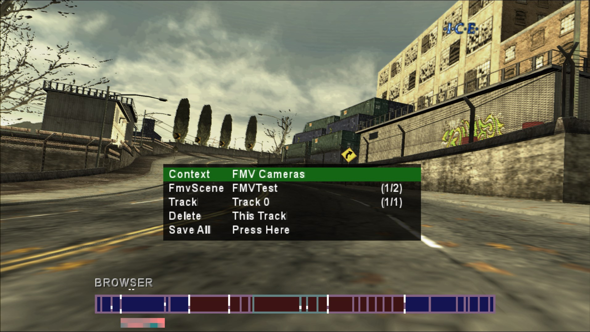

# ICE enabler for NFS Most Wanted OPM Demo (PS2)

This PCSX2 game plugin restores the hidden ICE editor found within the OPM demo build of NFS Most Wanted.

It also adds the proper trigger for the Debug World Camera, so you can use that just like on a real debug build!

NOTE: this currently only works with the NTSC-U demo builds.

## Installation

1. Get [the latest build of PCSX2 Fork with Plugins here](https://github.com/ASI-Factory/PCSX2-Fork-With-Plugins/releases/tag/latest) (MSVC AVX2 build should be good for most people)

2. Place `NFSMW-PS2-ICE.elf` (or `NFSMW-PS2-ICE-ShowFPS.elf`) in the `PLUGINS` directory of PCSX2 Fork

3. Add and enable included cheats to unlock the demo version.

## Usage

- Make sure you have keys bound to the second controller port
- Go ingame by any method (SkipFE recommended)
- On the second controller port, press R1 to launch ICE
- Use the second controller to control ICE. Press Select to exit (and/or to enter Debug World Camera, it's a bit buggy when exiting ICE)

## Advanced Usage

- It is highly recommended that you extract all of the game data somewhere with write permissions and enable "Enable Host Filesystem" under Emulation settings in PCSX2 and launch the game by launching the ELF directly. This will allow you to write data to your drive!

## Is it possible to run this on a PS2?

As of now, not yet. [There is a tool made by ermaccer](https://github.com/ermaccer/ps2plugininjector) that could inject it into the executable, however, it's not fully stable because it doesn't relocate the code (it relies on a fixed section and prays that it doesn't get overwritten by the game).

## How does this work?

Simply put - the ICE editor already exists within the game.

This simply restores ScreenPrintf, the poly (2D) rendering and adds supporting code in appropriate places to work.

## What even is ICE?

ICE is an abbreviation for "Ingame Camera Editor".

[See this YouTube video for a demonstration by Habib Zargarpour.](https://www.youtube.com/watch?v=95DdSLR5Uyo)

In short - this is a tool that can be used to direct and view cutscenes ingame in real time.

This editor alone isn't enough to create full NIS scene data for the game, however, what it can do is generate necessary camera data.

Car recording is done by a separate piece of code and not by ICE itself directly.

Additional support tools are needed to produce necessary chunks that the game will be able to read. 

This is usually done by a tool that reads the SpeedScript (.moo) files produced by ICE and creates a camera set chunk.
